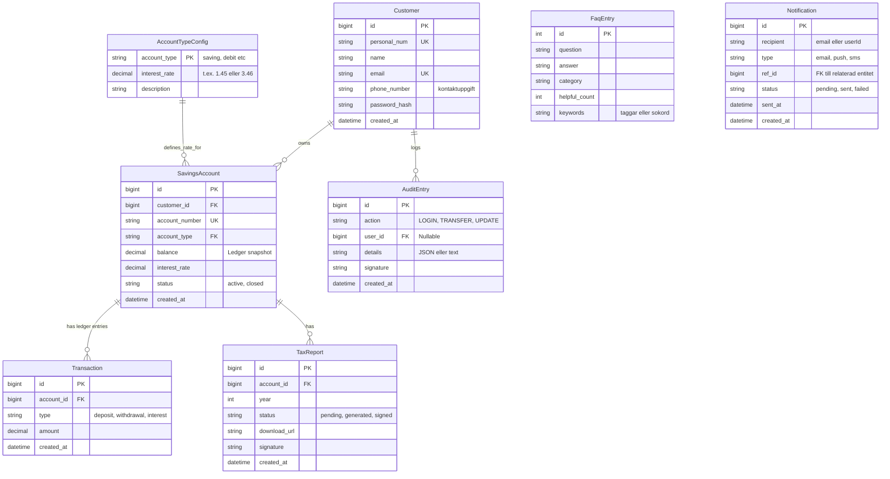

# Nordiska Sparbanken — Koduppgift

Detta repo innehåller v1 av Nordiska Sparbankens kundportal. Koden är **avsiktligt skriven som spaghetti** — det är en pedagogisk utgångspunkt. Din uppgift är att refaktorera den till v2.

## Snabbstart

```bash
git clone <repo-url>
cd ChasChallenge/infra
docker compose up
```

Öppna [http://localhost:8080](http://localhost:8080) i webbläsaren.

**Testinloggning:**
| E-post | Lösenord |
|--------|----------|
| anna@example.com | password123 |
| erik@example.com | password123 |

## Vad som fungerar i v1

- Inloggning med e-post och lösenord
- Dashboard visar saldo och beräknad årsränta per konto
- Insättning och uttag (fungerar korrekt vid en användare i taget)
- Mailbekräftelse vid insättning och uttag (levereras bara om en SMTP-server finns, fel syns aldrig)
- Nedladdning av skatteunderlag som fil
- FAQ-sidan svarar på vanliga frågor (enkel nyckelordsmatchning)
- Utloggning

## Vad som inte fungerar

- **Parallella insättningar korrupterar saldo** — race condition, ingen transaktion eller radlåsning
- **Skatteunderlag tar lång tid** — `Thread.Sleep(50)` per transaktion blockerar request-tråden
- **MD5-lösenord** — kryptografiskt brutet, enkelt att knäcka med rainbow tables
- **Session löper ut om ett år** — utloggning rensar inte serversidans session
- **FAQ-assistenten svarar ofta fel** - första nyckelordsträffen vinner, ingen rankning, ingen normalisering utöver gemener
- **Mail skickas inline från sidhanteraren** - `SmtpClient` direkt i Deposit-handlern, ingen kö, ingen retry, fel sväljs tyst
- **Inga felloggar** — alla undantag sväljs, ingen spårbarhet
- **Inloggningsuppgifter i källkoden** — connectionstring med lösenord i `appsettings.json` och hårdkodad fallback i varje fil

## Vad ska ni bygga

Se [docs/v2-targets.md](docs/v2-targets.md) för fullständig specifikation.

Kortversion:
- .NET 8 Web API + EF Core 8 + ledger-mönster (ersätter direkta balance-uppdateringar)
- React 18 SPA (ersätter Razor Pages)
- BCrypt-lösenord + JWT-autentisering
- Bakgrundsjobb för PDF-generering
- Regelstyrd FAQ-sökning mot kontrollerad FAQ-databas med korrekt träfflogik
- Notifieringar som egen komponent med kö och retry
- Rate limiting på känsliga endpoints
- Native C/C++-moduler för batch-PDF och PDF-signering
- Strukturerad loggning och /health-endpoint

## Datamodell (ER-diagram v2)

Följande datamodell och entitetsrelationer gäller för v2 av Nordiska Sparbanken:



## Dokumentation

| Fil | Innehåll |
|-----|----------|
| [docs/architecture.md](docs/architecture.md) | v1-arkitektur, databasschema, sekvensdiagram |
| [docs/known-bugs.md](docs/known-bugs.md) | Alla avsiktliga buggar förklarade med korrekta lösningar |
| [docs/README-pain-points.md](docs/README-pain-points.md) | Vad som fungerar, vad som inte fungerar, var v2 bör börja |
| [docs/v2-targets.md](docs/v2-targets.md) | Fullständig kravspec för v2 |
| [native/README.md](native/README.md) | Spec för native C/C++-moduler |

## Mappstruktur

```
ChasChallenge/
  backend/NordiskaPortal/   .NET 6 Razor Pages (v1 monolith)
  frontend/                 (tom — Razor Pages är frontendet i v1)
  native/                   (tom — se native/README.md för v2-spec)
  infra/
    docker-compose.yml      PostgreSQL 12 + app-container
    seed.sql                Databasschema och testdata
  docs/                     Arkitektur, kända buggar, v2-mål
```
