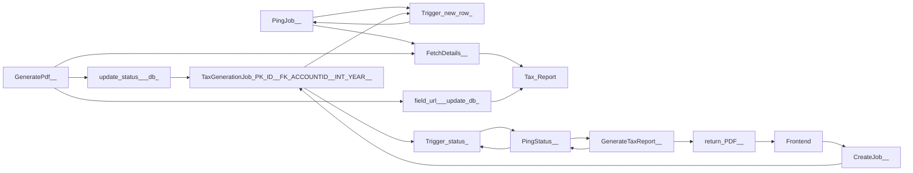

Okej så för version 1 är det viktigaste att snabbt få ut en fungerande worker med controller och databashämtning. 

TODO (ej ordnad)

1. Skapa en controller med rätt endpoint på båda moduler (en för report, en för worker).
2. Skapa ett SQL table för ett jobb med logiska fält 
3. Skapa records fram och tillbaka (CreateJob, FetchJob, FetchTaxReport)
4. skapa view 
5. sätt en rekommenderad trigger och kolla hur den kan anknytas till worker
6. skapa en service klass åt worker som använder Iqueryable ör att hämta rätt data
7. test generera
8. kolla om du kan få in streaming över controller (hur tänks det här?)
9. samma med status. 

ideer till sen: 
- get status
- en kolumn i jobs som kollar hur många sidor / delar av pdf som genererats (om möjligt?) ,ifall jobb avbryts. Summan här är oavsett vad att vi måste ha en lösning på att inte återskapa hela pdf filer
- måste ha en fet komrpimering!!!!!
- kanske message  bus? kolla vilka fördelar det ger som inte triggger ger!
- kika på custom TCL / HTTPS nyckel?

 

                                                                                                                      

                                                                                                                          

                                                                                                                        

## Architecture Diagram Overview

| Component | Type | Details |
|:---|:---|:---|
| **Tax Report** | `STORAGE & STREAM` | S3 / Object Bucket |
| **Trigger(new row)** | `SERVICES` | Serverless Trigger |
| **PingJob()** | `ER & CLASS MODEL` | Methods, getters... |
| **FetchDetails()** | `STORAGE & STREAM` | Kafka / Event Topics |
| **GeneratePdf()** | `STORAGE & STREAM` | Kafka / Event Topics |
| **field(url) (update db)** | `ER & CLASS MODEL` | id [PK], fields... |
| **TaxGenerationJob(PK ID, FK ACCOUNTID, INT YEAR, ** | `STORAGE & STREAM` | S3 / Object Bucket |
| **update(status) (db)** | `ER & CLASS MODEL` | id [PK], fields... |
| **Trigger(status)** | `SERVICES` | Serverless Trigger |
| **PingStatus()** | `ER & CLASS MODEL` | Methods, getters... |
| **Frontend** | `STORAGE & STREAM` | S3 / Object Bucket |
| **GenerateTaxReport()** | `ER & CLASS MODEL` | Methods, getters... |
| **CreateJob()** | `ER & CLASS MODEL` | Methods, getters... |
| **return PDF()** | `ER & CLASS MODEL` | Methods, getters... |

### Connectors & Data Pipes

<!-- ARCH_DIAGRAM_STATE: {"modules":[{"id":"mod_1790137703360","category":"STORAGE & STREAM","title":"Tax Report","subtitle":"S3 / Object Bucket","icon":"hard-drive","x":14.15716552734375,"y":788.3995666503906,"w":180},{"id":"mod_1790137720657","category":"SERVICES","title":"Trigger(new row)","subtitle":"Serverless Trigger","icon":"zap","x":197.97344970703125,"y":854.4601440429688,"w":180},{"id":"mod_1790137749650","category":"ER & CLASS MODEL","title":"PingJob()","subtitle":"Methods, getters...","icon":"box","x":359.2992248535156,"y":857.130615234375,"w":180},{"id":"mod_1790138371425","category":"STORAGE & STREAM","title":"FetchDetails()","subtitle":"Kafka / Event Topics","icon":"radio","x":507.9355773925781,"y":854.4791259765625,"w":180},{"id":"mod_1790138432513","category":"STORAGE & STREAM","title":"GeneratePdf()","subtitle":"Kafka / Event Topics","icon":"radio","x":653.6647033691406,"y":805.4545288085938,"w":180},{"id":"mod_1790138498258","category":"ER & CLASS MODEL","title":"field(url) (update db)","subtitle":"id [PK], fields...","icon":"table","x":470.6438903808594,"y":748.1060791015625,"w":180},{"id":"mod_1790138620638","category":"STORAGE & STREAM","title":"TaxGenerationJob(PK ID, FK ACCOUNTID, INT YEAR, ","subtitle":"S3 / Object Bucket","icon":"hard-drive","x":15.473480224609375,"y":733.82568359375,"w":180},{"id":"mod_1790138662453","category":"ER & CLASS MODEL","title":"update(status) (db)","subtitle":"id [PK], fields...","icon":"table","x":373.3143615722656,"y":971.5718994140625,"w":180},{"id":"mod_1790138697474","category":"SERVICES","title":"Trigger(status)","subtitle":"Serverless Trigger","icon":"zap","x":140.34091186523438,"y":595.2745361328125,"w":180},{"id":"mod_1790138746489","category":"ER & CLASS MODEL","title":"PingStatus()","subtitle":"Methods, getters...","icon":"box","x":363.0776062011719,"y":593.8919677734375,"w":180},{"id":"mod_1790138927310","category":"STORAGE & STREAM","title":"Frontend","subtitle":"S3 / Object Bucket","icon":"hard-drive","x":772.8976135253906,"y":618.7121276855469,"w":180},{"id":"mod_1790138968916","category":"ER & CLASS MODEL","title":"GenerateTaxReport()","subtitle":"Methods, getters...","icon":"box","x":507.7840270996094,"y":592.5283508300781,"w":180},{"id":"mod_1790138980747","category":"ER & CLASS MODEL","title":"CreateJob()","subtitle":"Methods, getters...","icon":"box","x":648.3900451660156,"y":652.5283203125,"w":180},{"id":"mod_1790138993778","category":"ER & CLASS MODEL","title":"return PDF()","subtitle":"Methods, getters...","icon":"box","x":647.5284729003906,"y":592.5188903808594,"w":180}],"connections":[{"id":"conn_1790137759777","fromNode":"mod_1790137749650","fromPort":"left","toNode":"mod_1790137720657","toPort":"right","label":""},{"id":"conn_1790137843320","fromNode":"mod_1790137720657","fromPort":"right","toNode":"mod_1790137749650","toPort":"left","label":""},{"id":"conn_1790138411240","fromNode":"mod_1790138371425","fromPort":"left","toNode":"mod_1790137703360","toPort":"right","label":""},{"id":"conn_1790138531008","fromNode":"mod_1790138432513","fromPort":"left","toNode":"mod_1790138498258","toPort":"right","label":""},{"id":"conn_1790138626538","fromNode":"mod_1790138620638","fromPort":"right","toNode":"mod_1790137720657","toPort":"left","label":""},{"id":"conn_1790138631193","fromNode":"mod_1790138498258","fromPort":"left","toNode":"mod_1790137703360","toPort":"right","label":""},{"id":"conn_1790138676343","fromNode":"mod_1790138432513","fromPort":"left","toNode":"mod_1790138662453","toPort":"right","label":""},{"id":"conn_1790138680072","fromNode":"mod_1790138662453","fromPort":"left","toNode":"mod_1790138620638","toPort":"right","label":""},{"id":"conn_1790138741753","fromNode":"mod_1790138620638","fromPort":"right","toNode":"mod_1790138697474","toPort":"left","label":""},{"id":"conn_1790138774520","fromNode":"mod_1790138697474","fromPort":"right","toNode":"mod_1790138746489","toPort":"left","label":""},{"id":"conn_1790138847320","fromNode":"mod_1790138746489","fromPort":"left","toNode":"mod_1790138697474","toPort":"right","label":""},{"id":"conn_1790138874601","fromNode":"mod_1790137749650","fromPort":"right","toNode":"mod_1790138371425","toPort":"left","label":""},{"id":"conn_1790139013592","fromNode":"mod_1790138746489","fromPort":"right","toNode":"mod_1790138968916","toPort":"left","label":""},{"id":"conn_1790139014687","fromNode":"mod_1790138968916","fromPort":"left","toNode":"mod_1790138746489","toPort":"right","label":""},{"id":"conn_1790139038495","fromNode":"mod_1790138968916","fromPort":"right","toNode":"mod_1790138993778","toPort":"left","label":""},{"id":"conn_1790139039280","fromNode":"mod_1790138993778","fromPort":"right","toNode":"mod_1790138927310","toPort":"left","label":""},{"id":"conn_1790139085527","fromNode":"mod_1790138927310","fromPort":"left","toNode":"mod_1790138980747","toPort":"right","label":""},{"id":"conn_1790139124400","fromNode":"mod_1790138980747","fromPort":"left","toNode":"mod_1790138620638","toPort":"right","label":""},{"id":"conn_1790139361539","fromNode":"mod_1790138432513","fromPort":"left","toNode":"mod_1790138371425","toPort":"right","label":""}],"methodologyNodes":[],"headlessIcons":[],"pattern":"blank"} -->
