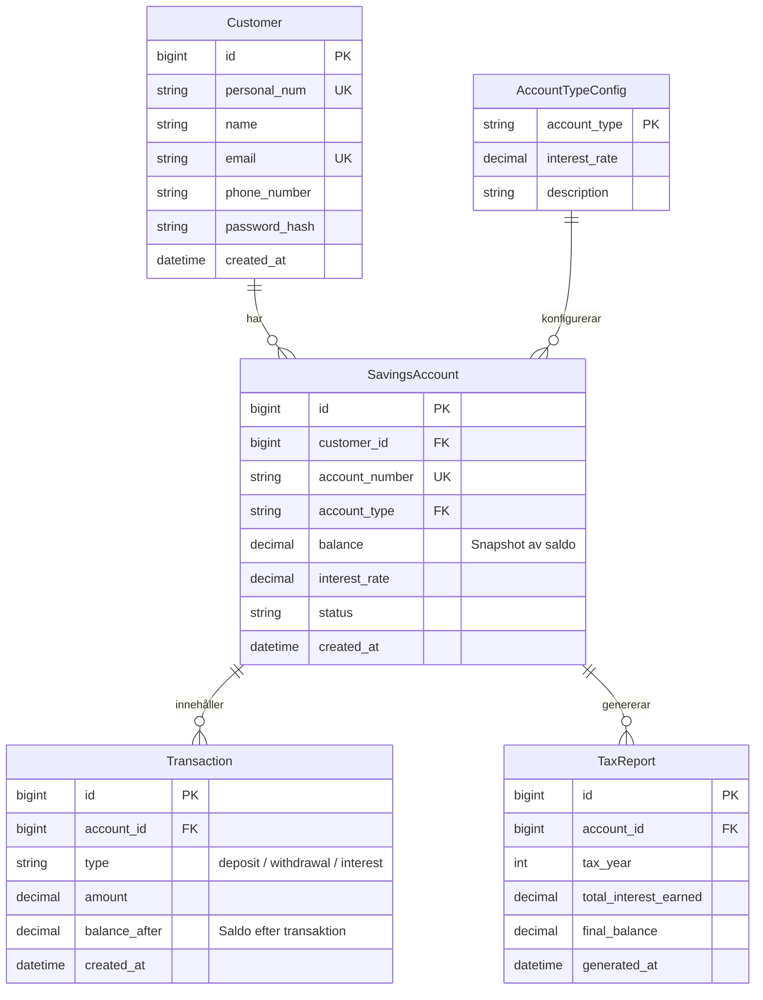

# Arkitekturdokumentation - Nordiska Sparbanken v2

Detta dokument beskriver den övergripande arkitekturen, designmönstren och säkerhetsbesluten för version 2 av Nordiska Sparbankens kundportal och API.

---

## 1. Systemöversikt

Nordiska Sparbanken v2 är designad som en **modulär monolit** för att kombinera enkelheten i distribution med tydliga modulgränser och hög testbarhet.

```
┌─────────────────────────────────────────────────────────────┐
│                 Klient (React 18 SPA)                       │
│           TypeScript, Vite, TailwindCSS / CSS               │
└──────────────────────────────┬──────────────────────────────┘
                               │ HTTPS / JSON (HttpOnly Cookies)
┌──────────────────────────────▼──────────────────────────────┐
│                  Nordiska.FrontendApi                       │
│        Controllers, Scalar/Swagger, Auth, Middleware        │
└───────┬──────────────────────┬──────────────────────┬───────┘
        │                      │                      │
┌───────▼────────┐     ┌───────▼────────┐     ┌───────▼────────┐
│ Banking Module │     │   Faq Module   │     │Reporting Module│
│  Domain & App  │     │  Domain & App  │     │  Domain & App  │
└───────┬────────┘     └───────┬────────┘     └───────┬────────┘
        │                      │                      │
┌───────▼──────────────────────▼──────────────────────▼───────┐
│               Entity Framework Core 8 DbContexts            │
│       BankingDbContext   FaqDbContext   ReportingDbContext  │
└──────────────────────────────┬──────────────────────────────┘
                               │ Npgsql (Connection Pooling)
┌──────────────────────────────▼──────────────────────────────┐
│                    PostgreSQL 15 Database                   │
│         customers, savings_accounts, transactions...        │
└─────────────────────────────────────────────────────────────┘
```

---

## 2. Modulindelning

Lösningen är uppdelad i avgränsade moduler under `backend/src/Modules/`:

### `Modules/Banking`
- **Ansvar:** Hanterar kunder, bankkonton, insättningar, uttag, saldoberäkningar och integration mot BankID.
- **Entiteter:** `Customer`, `SavingsAccount`, `Transaction`, `AccountTypeConfig`.
- **Databasåtkomst:** `BankingDbContext` med specifika konfigurationer och migrationer.

### `Modules/Faq`
- **Ansvar:** Hanterar FAQ-sökningar, svar och administrativ hantering av frågor.
- **Databasåtkomst:** `FaqDbContext`.

### `Modules/Reporting`
- **Ansvar:** Generering och lagring av skatteunderlag och historiska rapporter.
- **Databasåtkomst:** `ReportingDbContext`.

### `BuildingBlocks`
- Delad infrastruktur och gemensamma moduler såsom standardiserad felhantering (`AddErrorHandling`), gemensamma databashjälpare och middleware.

---

## 3. Datamodell & Ledger-mönstret

För att förhindra race conditions och saldokorruption vid samtidiga transaktioner använder v2 ett **Ledger-mönster (huvudboksmodell)**:



### Principer för saldohantering:
1. **Append-Only transaktioner:** Varje insättning och uttag skapar en oföränderlig rad i `transactions`-tabellen.
2. **Saldoberäkning:** `SavingsAccount.balance` fungerar som en cachad snapshot som uppdateras atomärt inom samma databastransaktion (`IsolationLevel.ReadCommitted` eller `RepeatableRead`).
3. **Spårbarhet:** `balance_after` på varje transaktionsrad gör det möjligt att verifiera saldohistoriken bakåt i tiden.

---

## 4. Autentisering & Säkerhet

```
Klient (Webbläsare)                   FrontendApi                    Databas
        │                                  │                            │
        │ 1. POST /api/auth/login          │                            │
        │    (eller BankID /bankid/login)  │                            │
        ├─────────────────────────────────►│                            │
        │                                  │ 2. Verifiera hash / BankID │
        │                                  ├───────────────────────────►│
        │                                  │◄───────────────────────────┤
        │                                  │                            │
        │                                  │ 3. Generera signerad JWT   │
        │ 4. Set-Cookie: nordiska_auth_token; HttpOnly; SameSite=Strict │
        │◄─────────────────────────────────┤                            │
        │                                  │                            │
        │ 5. GET /api/customers/me         │                            │
        │    (Cookie skickas automatiskt)  │                            │
        ├─────────────────────────────────►│ 6. Validera JWT & Claims   │
        │                                  │    från Cookie             │
        │ 7. 200 OK (Kunddata)             │                            │
        │◄─────────────────────────────────┤                            │
```

### Säkerhetsmekanismer:
- **HttpOnly Cookies:** JWT-tokens lagras i säkra cookies med flaggorna `HttpOnly`, `Secure` (i produktion) och `SameSite=Strict`. Detta förhindrar helt åtkomst via JavaScript och skyddar mot Cross-Site Scripting (XSS).
- **Lösenordshantering:** Användarlösenord hashas med ASP.NET Core Identitys `PasswordHasher<Customer>` baserat på PBKDF2 med HMAC-SHA256 och unika salts per användare.
- **CORS-policy:** Endast betrodda frontend-ursprung (definierade i `Cors:AllowedOrigins`) tillåts kommunicera med API:et. `AllowCredentials` är aktiverat för att stödja cookies.
- **Beroendeinjektionsvalidering:** `ValidateScopes` och `ValidateOnBuild` säkerställer att inga instanser med felaktig livslängd (Captive Dependencies) skapas.

---

## 5. Felhantering och API-standarder

### RFC 7807 ProblemDetails
Alla fel returneras i standardiserat ProblemDetails-format:
```json
{
  "type": "https://tools.ietf.org/html/rfc7231#section-6.5.1",
  "title": "Bad Request",
  "status": 400,
  "detail": "Ogiltigt personnummer eller lösenord.",
  "traceId": "00-4bf92f3577b34da6a3ce929d0e0e4736-00f067aa0ba902b7-01"
}
```

### API-dokumentation och Scalar
- Alla controllers och DTOs är försedda med XML-kommentarer.
- OpenAPI v3-specifikationen genereras dynamiskt vid runtime via `/openapi/v1.json`.
- Det moderna gränssnittet Scalar är integrerat under `/scalar/v1` för interaktiv testning av API:et.

---

## 6. Driftsättning och Containerisering

Lösningen paketeras via en multi-stage [Dockerfile](file:///e:/Projects/Chas%20Challenge%2026%20EXTENED/repo/Dockerfile):
1. **Stage 1 (Frontend Builder):** Bygger React SPA-koden med Node.js och producerar statiska filer i `dist/`.
2. **Stage 2 (Backend Builder):** Återställer NuGet-paket och kompilerar .NET 8-applikationen i `Release`-läge.
3. **Stage 3 (Final Runtime):** Minimal ASP.NET 8 Runtime-image där React-frontendens filer placeras i `wwwroot/` och servas direkt av Web API:et med fallback till `index.html` för klientsidans routing.
