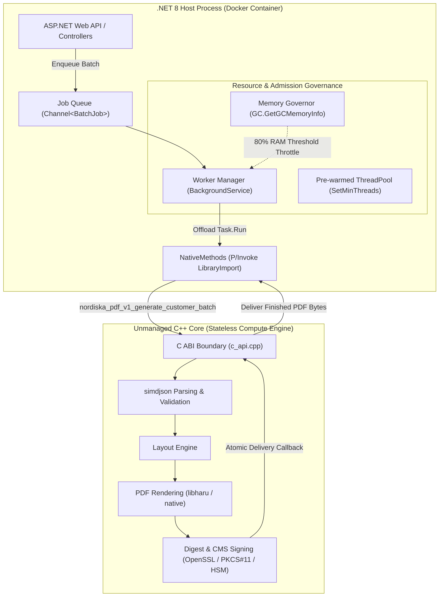
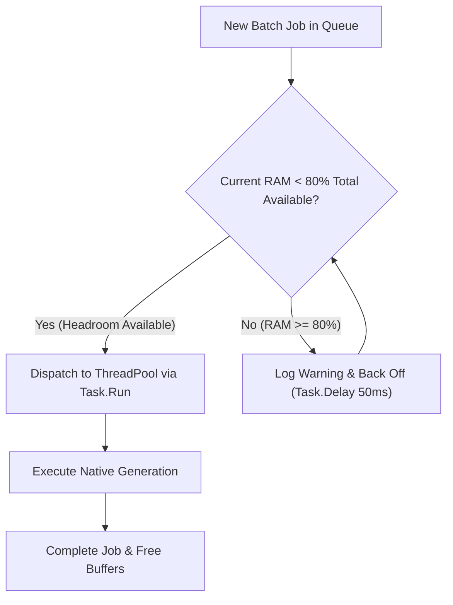

# Architecture Specification: .NET PDF Worker Manager & Native Engine Integration

## Executive Summary

This document establishes the architecture for the **Nordiska PDF Generation and Signing Subsystem**, defining the boundary between the **unmanaged C++ generation engine** (`libnordiska_pdf_generator_c_api.so`) and the **managed .NET Worker Manager** (`Nordiska.Reporting.Worker`).

The design adheres to the **stateless compute engine pattern**: the C++ native core remains a pure, synchronous, thread-safe function with zero internal thread pools or state, while the .NET runtime orchestrates job queues, thread management, memory governance, and asynchronous I/O.

---

## 1. Architectural Boundaries & Division of Labor



### Separation of Responsibilities

| Subsystem | Component | Responsibilities |
| :--- | :--- | :--- |
| **C++ Core** | `libnordiska_pdf_generator_c_api` | • Zero internal background threads or global state.<br>• Synchronous parsing, layout, rendering, and cryptographic signing.<br>• Strict all-or-nothing customer batch contract (atomic execution).<br>• Thread-local error diagnostics (`nordiska_pdf_v1_get_last_error`). |
| **.NET Runtime** | `Nordiska.Reporting.Worker` | • Job queuing, scheduling, and database status persistence (`TaxReportJob`).<br>• System memory governance and container cgroup limit enforcement.<br>• ThreadPool pre-warming and concurrency management.<br>• Error handling, logging, OpenTelemetry tracing, and graceful cancellation. |

---

## 2. Concurrency Model: Amortizing Network Latency with RAM

### The CPU vs. I/O Latency Problem
When high-assurance PDF signing is enabled, the native signer must calculate the SHA-256 byte-range digest and submit it to an external signing authority (Remote HSM, CSC API, or BankID service).

* **Local Rendering:** ~5–15 ms of pure CPU work per document.
* **External Signing HTTP RTT:** ~200–1,000 ms of pure network I/O wait.

If concurrency is restricted to CPU core count (e.g. 16 threads for 16 cores):
$$\text{Throughput} = \frac{16 \text{ workers}}{0.5\text{ s}} = 32 \text{ customer batches/sec}$$
The 16 CPU cores remain **~95% idle**, completely bottlenecked by network round-trip time.

### The Solution: Elastic Concurrency Traded for RAM
Because threads waiting on external HTTP responses consume almost zero CPU, the .NET runtime can scale to **hundreds or thousands of concurrent in-flight batches**.

* **Memory Cost per In-Flight Batch:** Input JSON (~20 KB) + Output PDF (~50–100 KB) + Context Overhead $\approx 100 \text{ KB}$.
* **10,000 Concurrent In-Flight Batches:** $10,000 \times 100 \text{ KB} \approx \mathbf{1 \text{ GB of RAM}}$.
* **Projected Throughput:**
  $$\text{Throughput} = \frac{1,000 \text{ concurrent batches}}{0.5\text{ s}} = \mathbf{2,000 \text{ batches/sec}}$$

---

## 3. Container-Aware Memory Governance (The 80% Rule)

In a containerized environment (Docker / Kubernetes), exceeding memory limits causes the Linux kernel cgroup controller to send `SIGKILL` (OOM-killer), crashing the application.

To protect the container and ensure the Web API always retains sufficient headroom, the Worker Manager enforces an **admission throttle at 80% of total available memory**.



### .NET Cgroup-Aware Memory Check
```cs
public static class MemoryGovernor
{
    private const double MaxAllowedRamRatio = 0.80; // 80% ceiling

    public static bool HasMemoryHeadroom()
    {
        GCMemoryInfo memInfo = GC.GetGCMemoryInfo();
        long containerLimit = memInfo.TotalAvailableMemoryBytes;
        long currentLoad = memInfo.MemoryLoadBytes;

        return ((double)currentLoad / containerLimit) < MaxAllowedRamRatio;
    }
}
```

---

## 4. Startup Pre-Allocation Strategy

To eliminate thread ramp-up latency and prevent memory fragmentation under heavy spikes, the worker pre-allocates resources during container startup:

1. **ThreadPool Pre-warming:**
   The default .NET ThreadPool uses a slow hill-climbing algorithm (+1-2 threads/sec) when threads are blocked by synchronous P/Invoke calls.
   ```cs
   // In Program.cs at container startup:
   ThreadPool.SetMinThreads(1000, 1000);
   ```
2. **Buffer Reuse:**
   Payloads and error buffers utilize `ArrayPool<byte>.Shared` to prevent Large Object Heap (LOH) fragmentation.

---

## 5. C ABI P/Invoke Specification

### C Function Signatures (Exposed by `libnordiska_pdf_generator_c_api.so`)
```c
int nordiska_pdf_v1_generate_customer_batch(
    const uint8_t* json_utf8,
    size_t json_length,
    nordiska_pdf_delivery_callback callback,
    void* user_data
);

const char* nordiska_pdf_v1_get_last_error(void);
const char* nordiska_pdf_v1_status_name(int status);
size_t nordiska_pdf_v1_max_json_bytes(void);
```

### Managed .NET Interop Layer
```cs
namespace Nordiska.Modules.Reporting.Native;

[StructLayout(LayoutKind.Sequential)]
internal unsafe struct NordiskaPdfDocumentView
{
    public byte* DocumentId;
    public byte* Bytes;
    public nuint Length;
}

[StructLayout(LayoutKind.Sequential)]
internal unsafe struct NordiskaPdfBatchView
{
    public ulong CustomerId;
    public NordiskaPdfDocumentView* Documents;
    public nuint DocumentCount;
}

internal static unsafe partial class NativePdfApi
{
    private const string LibraryName = "nordiska_pdf_generator_c_api";

    [LibraryImport(LibraryName, EntryPoint = "nordiska_pdf_v1_generate_customer_batch")]
    [UnmanagedCallConv(CallConvs = [typeof(CallConvCdecl)])]
    public static partial int GenerateCustomerBatch(
        byte* jsonUtf8,
        nuint jsonLength,
        delegate* unmanaged[Cdecl]<NordiskaPdfBatchView*, void*, int> callback,
        void* userData
    );

    [LibraryImport(LibraryName, EntryPoint = "nordiska_pdf_v1_get_last_error")]
    [UnmanagedCallConv(CallConvs = [typeof(CallConvCdecl)])]
    public static partial byte* GetLastError();

    [LibraryImport(LibraryName, EntryPoint = "nordiska_pdf_v1_max_json_bytes")]
    [UnmanagedCallConv(CallConvs = [typeof(CallConvCdecl)])]
    public static partial nuint GetMaxJsonBytes();
}
```

---

## 6. Implementation Roadmap

### Phase 1: Native Interop & Verification
- [ ] Update `backend/src/Modules/Reporting/NativeCalls/PdfGenerationCalls.cs` to import `nordiska_pdf_v1_generate_customer_batch` and `nordiska_pdf_v1_get_last_error`.
- [ ] Update `Nordiska.Reporting.Worker.csproj` build copy targets to match `libnordiska_pdf_generator_c_api.so`.
- [ ] Format `sample-input-huge.json` into the valid customer batch schema (`$schema_version`, `customer_id`, `documents`).
- [ ] Execute `Nordiska.Reporting.Worker` console runner to verify end-to-end PDF generation against the new shared library.

### Phase 2: Memory Governor & Admission Gate
- [ ] Implement `MemoryGovernor` using `GC.GetGCMemoryInfo()` with the 80% container headroom rule.
- [ ] Implement `PdfGenerationEngine` wrapping the P/Invoke call with memory pinning (`fixed` / `GCHandle`) and structured exception mapping.

### Phase 3: Background Worker Manager
- [ ] Implement `Channel<CustomerBatchJob>` for high-throughput in-memory job dispatching.
- [ ] Build `PdfWorkerManager` as a `BackgroundService` with ThreadPool pre-warming (`ThreadPool.SetMinThreads`).
- [ ] Add support for optional database persistence (`TaxReportJob`) to integrate seamlessly with the frontend API when ready.

