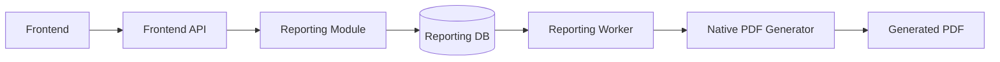

### test

```mermaid
flowchart LR
    A[Frontend] --> B[Frontend API]
    B --> C[Reporting Module]
    C --> D[(Reporting DB)]
    D --> E[Reporting Worker]
    E --> F[Native PDF Generator]
    F --> G[Generated PDF]
```
