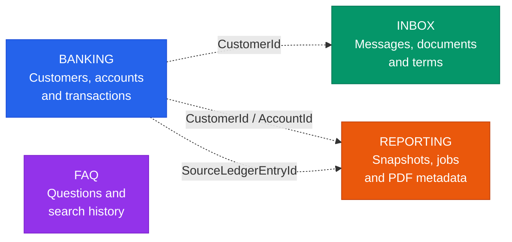
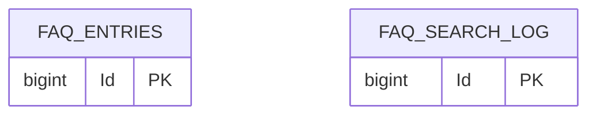
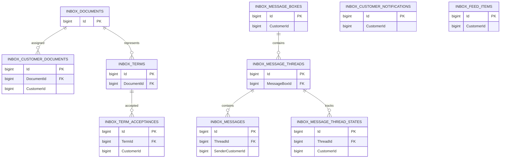
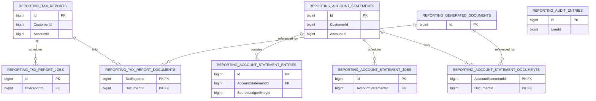
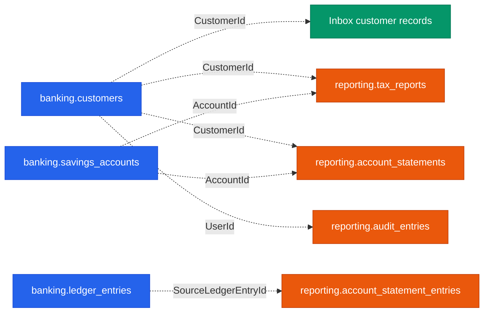

# Nordiska Database

### Current PostgreSQL schema overview

[Overview](#overview) ·
[Banking](#banking-schema) ·
[FAQ](#faq-schema) ·
[Inbox](#inbox-schema) ·
[Reporting](#reporting-schema) ·
[Module boundaries](#module-boundaries)

---

## Overview

| Schema | Responsibility | Tables |
|---|---|---:|
| `banking` | Customers, authentication, accounts and transactions | 14 |
| `faq` | FAQ content and search history | 2 |
| `inbox` | Messages, documents, terms and notifications | 10 |
| `reporting` | Report snapshots, generation jobs and PDF metadata | 9 |
| **Total** |  | **35** |

### Relationship legend

| Diagram | Meaning |
|---|---|
| Solid relationship | Enforced database foreign key |
| Dotted relationship | Scalar reference across module boundaries |
| `PK` | Primary key |
| `FK` | Foreign key |

> Cross-schema identifiers such as `CustomerId`, `AccountId` and
> `SourceLedgerEntryId` are intentionally stored as scalar values.
> PostgreSQL does not enforce foreign keys between the modules.

---

## Banking schema

```mermaid
erDiagram
    BANKING_CUSTOMERS {
        bigint Id PK
    }

    BANKING_SAVINGS_ACCOUNTS {
        bigint Id PK
        bigint CustomerId FK
        string AccountType FK
    }

    BANKING_LEDGER_ENTRIES {
        bigint Id PK
        bigint AccountId FK
    }

    BANKING_ACCOUNT_TYPE_CONFIGS {
        string AccountType PK
    }

    BANKING_ACCOUNT_TYPE_RATE_HISTORIES {
        bigint Id PK
        string AccountType FK
    }

    BANKING_LOANS {
        bigint Id PK
        bigint CustomerId FK
    }

    BANKING_NOTIFICATIONS {
        bigint Id PK
    }

    BANKING_OPERATIONAL_MESSAGES {
        bigint Id PK
    }

    BANKING_ASPNET_ROLES {
        bigint Id PK
    }

    BANKING_ASPNET_ROLE_CLAIMS {
        bigint Id PK
        bigint RoleId FK
    }

    BANKING_ASPNET_USER_CLAIMS {
        bigint Id PK
        bigint UserId FK
    }

    BANKING_ASPNET_USER_LOGINS {
        string LoginProvider PK
        string ProviderKey PK
        bigint UserId FK
    }

    BANKING_ASPNET_USER_ROLES {
        bigint UserId PK, FK
        bigint RoleId PK, FK
    }

    BANKING_ASPNET_USER_TOKENS {
        bigint UserId PK, FK
        string LoginProvider PK
        string Name PK
    }

    BANKING_CUSTOMERS ||--o{ BANKING_SAVINGS_ACCOUNTS : owns
    BANKING_CUSTOMERS ||--o{ BANKING_LOANS : has

    BANKING_SAVINGS_ACCOUNTS ||--o{ BANKING_LEDGER_ENTRIES : contains

    BANKING_ACCOUNT_TYPE_CONFIGS ||--o{ BANKING_SAVINGS_ACCOUNTS : configures
    BANKING_ACCOUNT_TYPE_CONFIGS ||--o{ BANKING_ACCOUNT_TYPE_RATE_HISTORIES : tracks

    BANKING_ASPNET_ROLES ||--o{ BANKING_ASPNET_ROLE_CLAIMS : contains

    BANKING_CUSTOMERS ||--o{ BANKING_ASPNET_USER_CLAIMS : has
    BANKING_CUSTOMERS ||--o{ BANKING_ASPNET_USER_LOGINS : has
    BANKING_CUSTOMERS ||--o{ BANKING_ASPNET_USER_ROLES : assigned
    BANKING_CUSTOMERS ||--o{ BANKING_ASPNET_USER_TOKENS : owns

    BANKING_ASPNET_ROLES ||--o{ BANKING_ASPNET_USER_ROLES : contains
```

<strong>Show banking ER diagram</strong>

 

[Back to overview](#overview)

---

## FAQ schema

<strong>Show FAQ ER diagram</strong>

 

> The FAQ tables currently have no enforced foreign-key relationship.

[Back to overview](#overview)

---

## Inbox schema

<strong>Show Inbox ER diagram</strong>

 

[Back to overview](#overview)

---

## Reporting schema

<strong>Show Reporting ER diagram</strong>

 

[Back to overview](#overview)

---

## Module boundaries

The modules share identifiers without creating cross-schema database
foreign keys.

### Why no cross-schema foreign keys?

- Each module owns its own schema.
- Reporting stores immutable historical snapshots.
- The Reporting Worker only receives access to the reporting data it needs.
- Modules can evolve without creating tightly coupled database migrations.
- Least-privilege database permissions remain easier to enforce.

---

Current schemas: `banking` · `faq` · `inbox` · `reporting`

