# Database ER Diagram

Simplified overview of the current PostgreSQL database.

Table names are prefixed with their schema:

- `BANKING_*`
- `FAQ_*`
- `INBOX_*`
- `REPORTING_*`

```mermaid
erDiagram

    %% ========================================
    %% BANKING SCHEMA
    %% ========================================

    BANKING_CUSTOMERS {
        bigint Id PK
    }

    BANKING_SAVINGS_ACCOUNTS {
        bigint Id PK
        bigint CustomerId FK
        string AccountType FK
    }

    BANKING_LEDGER_ENTRIES {
        bigint Id PK
        bigint AccountId FK
    }

    BANKING_ACCOUNT_TYPE_CONFIGS {
        string AccountType PK
    }

    BANKING_ACCOUNT_TYPE_RATE_HISTORIES {
        bigint Id PK
        string AccountType FK
    }

    BANKING_LOANS {
        bigint Id PK
        bigint CustomerId FK
    }

    BANKING_NOTIFICATIONS {
        bigint Id PK
    }

    BANKING_OPERATIONAL_MESSAGES {
        bigint Id PK
    }

    BANKING_ASPNET_ROLES {
        bigint Id PK
    }

    BANKING_ASPNET_ROLE_CLAIMS {
        bigint Id PK
        bigint RoleId FK
    }

    BANKING_ASPNET_USER_CLAIMS {
        bigint Id PK
        bigint UserId FK
    }

    BANKING_ASPNET_USER_LOGINS {
        string LoginProvider PK
        string ProviderKey PK
        bigint UserId FK
    }

    BANKING_ASPNET_USER_ROLES {
        bigint UserId PK, FK
        bigint RoleId PK, FK
    }

    BANKING_ASPNET_USER_TOKENS {
        bigint UserId PK, FK
        string LoginProvider PK
        string Name PK
    }

    BANKING_CUSTOMERS ||--o{ BANKING_SAVINGS_ACCOUNTS : owns
    BANKING_CUSTOMERS ||--o{ BANKING_LOANS : has
    BANKING_SAVINGS_ACCOUNTS ||--o{ BANKING_LEDGER_ENTRIES : contains

    BANKING_ACCOUNT_TYPE_CONFIGS ||--o{ BANKING_SAVINGS_ACCOUNTS : configures
    BANKING_ACCOUNT_TYPE_CONFIGS ||--o{ BANKING_ACCOUNT_TYPE_RATE_HISTORIES : tracks

    BANKING_ASPNET_ROLES ||--o{ BANKING_ASPNET_ROLE_CLAIMS : contains
    BANKING_CUSTOMERS ||--o{ BANKING_ASPNET_USER_CLAIMS : has
    BANKING_CUSTOMERS ||--o{ BANKING_ASPNET_USER_LOGINS : has
    BANKING_CUSTOMERS ||--o{ BANKING_ASPNET_USER_ROLES : assigned
    BANKING_ASPNET_ROLES ||--o{ BANKING_ASPNET_USER_ROLES : contains
    BANKING_CUSTOMERS ||--o{ BANKING_ASPNET_USER_TOKENS : owns


    %% ========================================
    %% FAQ SCHEMA
    %% ========================================

    FAQ_ENTRIES {
        bigint Id PK
    }

    FAQ_SEARCH_LOG {
        bigint Id PK
    }


    %% ========================================
    %% INBOX SCHEMA
    %% ========================================

    INBOX_DOCUMENTS {
        bigint Id PK
    }

    INBOX_CUSTOMER_DOCUMENTS {
        bigint Id PK
        bigint DocumentId FK
        bigint CustomerId
    }

    INBOX_TERMS {
        bigint Id PK
        bigint DocumentId FK
    }

    INBOX_TERM_ACCEPTANCES {
        bigint Id PK
        bigint TermId FK
        bigint CustomerId
    }

    INBOX_MESSAGE_BOXES {
        bigint Id PK
        bigint CustomerId
    }

    INBOX_MESSAGE_THREADS {
        bigint Id PK
        bigint MessageBoxId FK
    }

    INBOX_MESSAGES {
        bigint Id PK
        bigint ThreadId FK
        bigint SenderCustomerId
    }

    INBOX_MESSAGE_THREAD_STATES {
        bigint Id PK
        bigint ThreadId FK
        bigint CustomerId
    }

    INBOX_CUSTOMER_NOTIFICATIONS {
        bigint Id PK
        bigint CustomerId
    }

    INBOX_FEED_ITEMS {
        bigint Id PK
        bigint CustomerId
    }

    INBOX_DOCUMENTS ||--o{ INBOX_CUSTOMER_DOCUMENTS : assigned
    INBOX_DOCUMENTS ||--o{ INBOX_TERMS : represents
    INBOX_TERMS ||--o{ INBOX_TERM_ACCEPTANCES : accepted
    INBOX_MESSAGE_BOXES ||--o{ INBOX_MESSAGE_THREADS : contains
    INBOX_MESSAGE_THREADS ||--o{ INBOX_MESSAGES : contains
    INBOX_MESSAGE_THREADS ||--o{ INBOX_MESSAGE_THREAD_STATES : tracks


    %% ========================================
    %% REPORTING SCHEMA
    %% ========================================

    REPORTING_TAX_REPORTS {
        bigint Id PK
        bigint CustomerId
        bigint AccountId
    }

    REPORTING_TAX_REPORT_JOBS {
        bigint Id PK
        bigint TaxReportId FK
    }

    REPORTING_ACCOUNT_STATEMENTS {
        bigint Id PK
        bigint CustomerId
        bigint AccountId
    }

    REPORTING_ACCOUNT_STATEMENT_ENTRIES {
        bigint Id PK
        bigint AccountStatementId FK
        bigint SourceLedgerEntryId
    }

    REPORTING_ACCOUNT_STATEMENT_JOBS {
        bigint Id PK
        bigint AccountStatementId FK
    }

    REPORTING_GENERATED_DOCUMENTS {
        bigint Id PK
    }

    REPORTING_TAX_REPORT_DOCUMENTS {
        bigint TaxReportId PK, FK
        bigint DocumentId PK, FK
    }

    REPORTING_ACCOUNT_STATEMENT_DOCUMENTS {
        bigint AccountStatementId PK, FK
        bigint DocumentId PK, FK
    }

    REPORTING_AUDIT_ENTRIES {
        bigint Id PK
        bigint UserId
    }

    REPORTING_TAX_REPORTS ||--o{ REPORTING_TAX_REPORT_JOBS : generates
    REPORTING_TAX_REPORTS ||--o{ REPORTING_TAX_REPORT_DOCUMENTS : links
    REPORTING_GENERATED_DOCUMENTS ||--o{ REPORTING_TAX_REPORT_DOCUMENTS : referenced_by

    REPORTING_ACCOUNT_STATEMENTS ||--o{ REPORTING_ACCOUNT_STATEMENT_ENTRIES : contains
    REPORTING_ACCOUNT_STATEMENTS ||--o{ REPORTING_ACCOUNT_STATEMENT_JOBS : generates
    REPORTING_ACCOUNT_STATEMENTS ||--o{ REPORTING_ACCOUNT_STATEMENT_DOCUMENTS : links
    REPORTING_GENERATED_DOCUMENTS ||--o{ REPORTING_ACCOUNT_STATEMENT_DOCUMENTS : referenced_by
```

> IDs such as `CustomerId`, `AccountId` and `SourceLedgerEntryId` may reference data in another module, but they are intentionally stored as scalar values without cross-schema foreign-key constraints.
