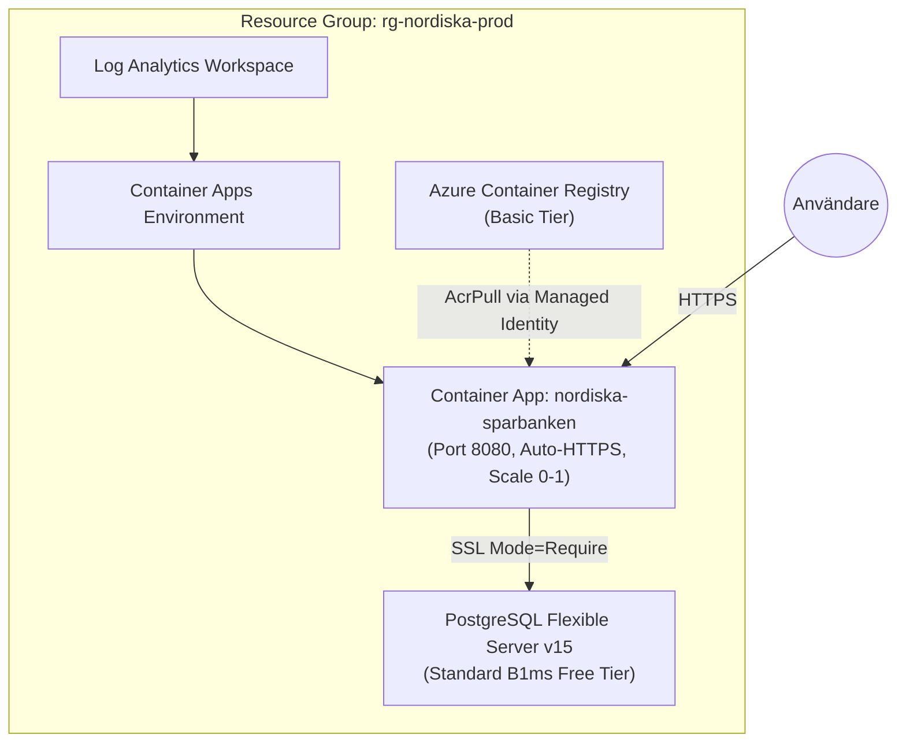

# Azure Infrastructure as Code (Bicep) — Nordiska Sparbanken v2

Detta bibliotek innehåller komplett **Infrastructure as Code (IaC)** i Bicep för att driftsätta Nordiska Sparbanken v2 på **Microsoft Azure** med **Azure Container Apps (ACA)**, **PostgreSQL Flexible Server** och **Azure Container Registry (ACR)**.

---

## 1. Arkitektur & Komponenter



---

## 2. Snabbstart: 1-Kommando Deployment

### Förutsättningar
- [Azure CLI](https://learn.microsoft.com/en-us/cli/azure/install-azure-cli) installerat.
- Ett aktivt Azure-konto (t.ex. *Azure for Students*).

### Steg 1: Logga in och välj prenumeration
```powershell
az login
az account set --subscription "<DITT_SUBSCRIPTION_ID_ELLER_NAMN>"
```

### Steg 2: Skapa Resursgrupp
```powershell
az group create --name rg-nordiska-prod --location swedencentral
```

### Steg 3: Driftsätt med Bicep
```powershell
az deployment group create `
  --resource-group rg-nordiska-prod `
  --template-file infra/azure/main.bicep `
  --parameters `
    dbAdminPassword="DittSuperHemligaDbLösenord2026!" `
    jwtSecretKey="SuperSecretNordiskaSigningKey2026AzureProdToken!"
```

När kommandot är klart skrivs din unika **HTTPS-webbadress** ut i terminalen under `applicationUrl`.

---

## 3. Bygg och Pusha Docker Containern till ACR

När infrastrukturen är provisionerad bygger och pushar du den skarpa appen till ditt nya Azure Container Registry:

```powershell
# 1. Hämta ACR-namnet från Azure
$ACR_NAME = (az acr list --resource-group rg-nordiska-prod --query "[0].name" -o tsv)
$ACR_LOGIN_SERVER = (az acr list --resource-group rg-nordiska-prod --query "[0].loginServer" -o tsv)

# 2. Logga in mot ACR
az acr login --name $ACR_NAME

# 3. Bygg och tagga containern
docker build -t "$ACR_LOGIN_SERVER/nordiska-sparbanken:latest" -f Dockerfile .

# 4. Pusha bilden till Azure
docker push "$ACR_LOGIN_SERVER/nordiska-sparbanken:latest"

# 5. Uppdatera Container Appen med den nya bilden
az containerapp update `
  --name nordiska-sparbanken `
  --resource-group rg-nordiska-prod `
  --image "$ACR_LOGIN_SERVER/nordiska-sparbanken:latest"
```

---

## 4. GitHub Actions CI/CD (Valfritt)

Om du vill att GitHub automatiskt ska bygga och deploya till Azure när du pushar till `main`, skapa `.github/workflows/deploy-azure.yml`:

```yaml
name: Deploy to Azure Container Apps

on:
  workflow_dispatch: # Manuell trigger
  push:
    branches:
      - main

permissions:
  id-token: write
  contents: read

jobs:
  build-and-deploy:
    runs-on: ubuntu-latest
    steps:
      - uses: actions/checkout@v4

      - name: Log in to Azure
        uses: azure/login@v2
        with:
          creds: ${{ secrets.AZURE_CREDENTIALS }}

      - name: Log in to ACR
        run: az acr login --name ${{ secrets.ACR_NAME }}

      - name: Build and push Docker image
        run: |
          IMAGE_URI="${{ secrets.ACR_LOGIN_SERVER }}/nordiska-sparbanken:${{ github.sha }}"
          docker build -t $IMAGE_URI -f Dockerfile .
          docker push $IMAGE_URI

      - name: Deploy to Azure Container App
        uses: azure/container-apps-deploy-action@v2
        with:
          containerAppName: ${{ secrets.AZURE_CONTAINER_APP_NAME }}
          resourceGroup: ${{ secrets.AZURE_RESOURCE_GROUP }}
          imageToDeploy: ${{ secrets.ACR_LOGIN_SERVER }}/nordiska-sparbanken:${{ github.sha }}
```

---

## 5. Avsluta / Radera Resurser (0 kr kostnad)

Vill du stänga ned allt när labben/presentationen är klar för att spara dina studentkrediter?
Kör bara:

```powershell
az group delete --name rg-nordiska-prod --yes --no-wait
```
Detta raderar alla resurser, databaser och containrar omedelbart.
